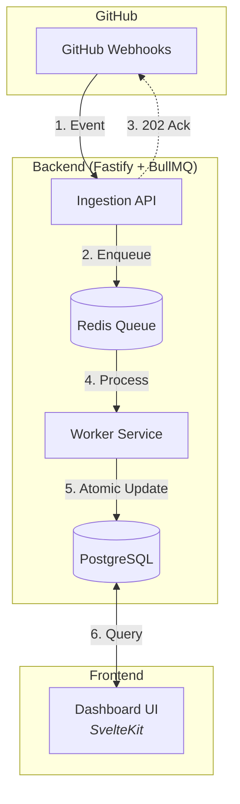

# GitHub Actions Monitoring MVP

A real-time monitoring system designed to provide organization-wide visibility into GitHub Actions workflows. This tool helps identify bottlenecks, track resource consumption, and monitor runner wait times in real-time.

---

## 🧪 The Experiment
This repository is a live experiment in **Advanced Agentic Coding**, combining:
1. **Antigravity**: A powerful agentic AI coding assistant.
2. **GitHub Spec Kit**: A framework for spec-first development.

### 🚫 No "Vibe Coding"
Every step in this project is discussed and planned with AI before implementation. We follow a strict cycle: **Spec → Plan → Task → Implement**. This ensures rigor, predictability, and high-quality results.

---

## 📊 Features
This GitHub App tracks the following key operational metrics:

- **Running Workflows**: Number of workflows currently in execution across the organization.
- **Queued Workflows**: Number of workflows waiting for an available runner.
- **Average Wait Time**: The average duration from workflow trigger to execution start (crucial for detecting runner shortages).
- **Total Executions**: Cumulative count of executions per workflow/repository.
- **Time Spent**: Total and average minutes consumed by workflows, enabling cost analysis.

---

## 🏗 Architecture
The system uses a fail-safe, event-driven pipeline to ensure consistency and throughput.

---

## 🛠 Tech Stack
- **Node.js 24+** + Fastify
- **BullMQ + Redis** (Durable processing)
- **Prisma + PostgreSQL**
- **SvelteKit + Tailwind CSS**

---

## � Getting Started
1. Clone the repository.
2. Install dependencies: `npm install`
3. Spin up infra: `docker-compose up -d`
4. Start development: `npm run dev`

---

## ⚖️ License
Distributed under the MIT License. See `LICENSE` for more information.